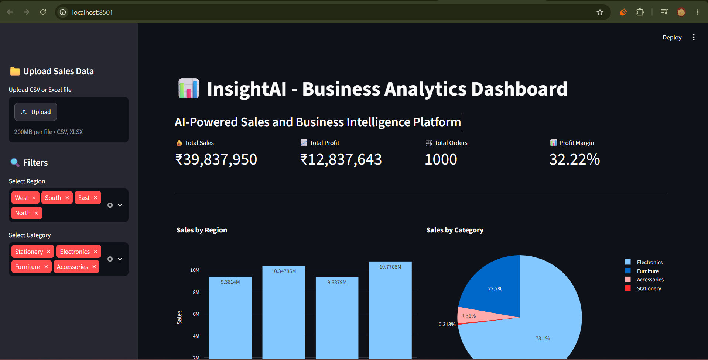

\# 📊 InsightAI - AI-Powered Business Analytics Dashboard


InsightAI is an AI-powered business analytics platform that combines Data Analytics, Machine Learning, and Generative AI to analyze sales data and generate intelligent business insights.


\## 🚀 Features


\- 📊 Interactive Sales Dashboard

\- 💰 Total Sales, Profit, Orders, and Profit Margin KPIs

\- 📈 Interactive Plotly Charts

\- 🗄️ MySQL Database Integration

\- 📁 CSV and Excel File Upload

\- 🔍 Region and Category Filters

\- 🤖 Gemini AI Business Analysis

\- 🔮 Machine Learning Sales Forecasting

\- ✨ AI-Generated Forecast Explanation


\## 🛠️ Technologies Used


\- Python

\- Pandas

\- MySQL

\- Streamlit

\- Plotly

\- Scikit-learn

\- Google Gemini API

\- NumPy


\## 🏗️ Project Architecture


```text

MySQL Database / CSV / Excel

&#x20;           ↓

&#x20;     Pandas Data Processing

&#x20;           ↓

&#x20;      Data Analysis

&#x20;           ↓

&#x20;  Streamlit Dashboard

&#x20;           ↓

&#x20;   Plotly Visualizations

&#x20;           ↓

&#x20;Machine Learning Forecasting

&#x20;           ↓

&#x20;    Google Gemini AI

&#x20;           ↓

&#x20;  Business Insights \& Analysis


InsightAI/

│

├── app.py

├── requirements.txt

├── README.md

├── .gitignore

│

├── data/

│   └── sales\_data.csv

│

├── src/

│   ├── analyze\_data.py

│   ├── db\_connection.py

│   ├── forecasting.py

│   ├── gemini\_ai.py

│   ├── generate\_data.py

│   └── import\_to\_mysql.py

│

└── test files/

&#x20;   ├── test\_forecasting.py

&#x20;   ├── test\_gemini.py

&#x20;   └── test\_mysql.py


⚙️ Installation

1\. Clone the repository

git clone https://github.com/adi301071/InsightAI.git

cd InsightAI

2\. Create a virtual environment

python -m venv venv

3\. Activate the virtual environment


Windows:


venv\\Scripts\\activate

4\. Install dependencies

pip install -r requirements.txt

🔐 Environment Variables


Create a .env file in the project root:


GEMINI\_API\_KEY=your\_api\_key\_here


Never upload your API key to GitHub.


▶️ Run the Application

streamlit run app.py


Then open:


http://localhost:8501

🤖 Generative AI Integration


Google Gemini AI is used to:


Analyze sales performance

Identify top-performing products

Generate business summaries

Explain Machine Learning sales forecasts

Provide business recommendations

🔮 Machine Learning Forecasting


The application uses historical sales data to forecast future sales trends.


The forecasting module:


Processes historical sales data

Aggregates monthly sales

Trains a Machine Learning model

Predicts future sales

Displays actual vs forecasted sales

📊 Dashboard Workflow

Upload Data / MySQL

&#x20;       ↓

Data Processing

&#x20;       ↓

KPI Calculation

&#x20;       ↓

Interactive Visualization

&#x20;       ↓

ML Sales Forecast

&#x20;       ↓

Gemini AI Business Analysis

👨‍💻 Author


Aditya Tiwari


B.Tech Computer Science Engineering

Medicaps University, Indore


⭐ Project Highlights


This project demonstrates practical experience in:


Data Analytics

SQL and Database Integration

Machine Learning

Generative AI

Dashboard Development

Business Intelligence

## 📸 Dashboard Preview



